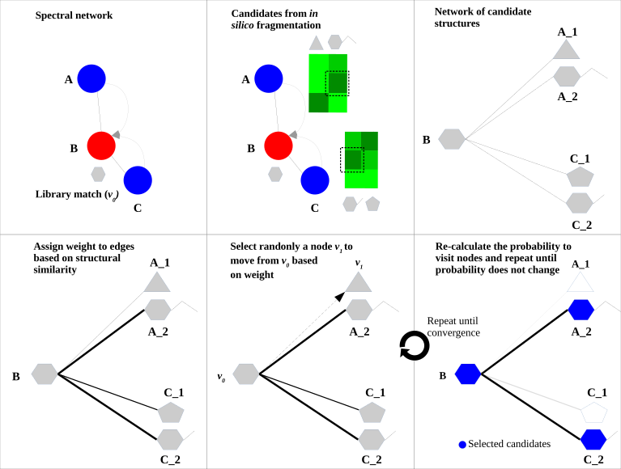
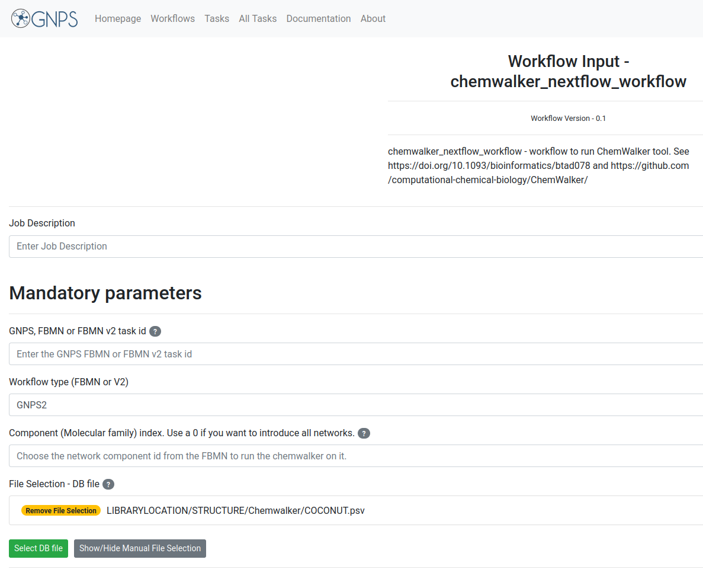
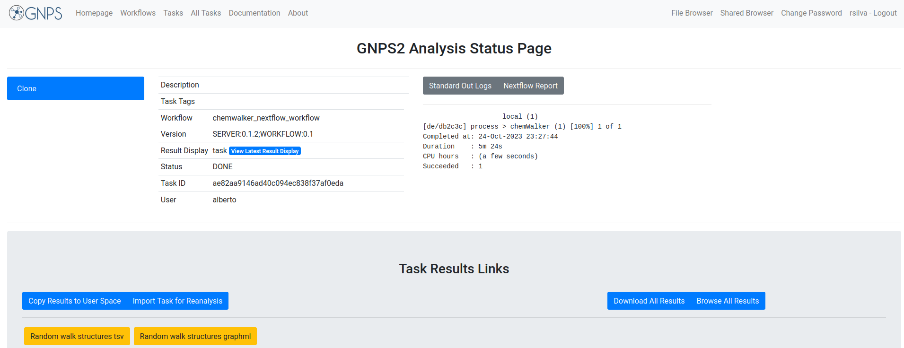
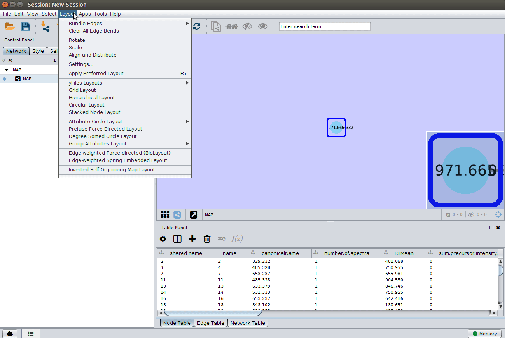

## ChemWalker 

ChemWalker is a python package to propagate spectral library match identities through candidate structures provided by in silico fragmentation, using random walk.

Check out the package's [documentation](https://github.com/computational-chemical-biology/ChemWalker).

## Data Input Preparation

The following inputs are used for NAP:

1. Molecular network task id, see [Molecular Networking](networking.md) (required)
2. Identifier(s) of databases and/or user provided databases (required)
3. Molecular family ID (component ID), 0 can be used to propagate annotations for all components (required)

### Structure database 

There are basically three options for database structure selection:

1. The default natural products database is the [COCONUT](https://coconut.naturalproducts.net/) database. 
2. Input an in house generated database. 
A standard format is required for the in house database. One can easily collect structures in the literature and format a tab separated files with SMILES strings and a character identifier of any kind, as the example database [Right-click, and Save link as](https://raw.githubusercontent.com/DorresteinLaboratory/GNPSDocumentation/master/docs/static/JNP_Kyobin.txt):  

Having an in house collection, the user has to first format the database, using the following [webserver](http://seriema.fcfrp.usp.br:5002/upload):

After submission for conversion the user should receive an email with the link to download a file in the following format [Right-click, and Save link as](https://raw.githubusercontent.com/DorresteinLaboratory/GNPSDocumentation/master/docs/static/JNP_Kyobin_formatted.txt):

## Running ChemWalker 

### NAP Workflow Selection

From the [Workflows option at GNPS2 page](https://gnps2.org/workflowinput?workflowname=chemwalker_nextflow_workflow). The image below shows an example of the most important parameters

The first parameter is the GNPS2 (or GNPS) network task id, this id can be found in the results email sent by GNPS/GNPS2 or in the url. The workflow types allowed are FBMN or Classic (V2) from GNPS and FBMN from GNPS2, named GNPS2 in the drop-down menu.

A detailed description of the parameters is provided [below](#parameter-walkthrough).

### Parameter Walk-through

| Parameter  | Description          | Default |
| ------------- |-------------| -----|
| GNPS task ID | GNPS molecular networking task id. | |
| Component Index  | Index of a connected component of interest in a Molecular Network. The propagation is limited to the connected component. Zero will perform propagation inside all components. | |
| Workflow type | FBMN or Classic (V2) from GNPS and FBMN from GNPS2, named GNPS2. | |
| Accuracy for exact mass candidate search (ppm) | Accuracy used for structure database search. The predicted neutral mass (for a given adduct selected) is compared to the exact mass of the structures provided. | 15 |
| Acquisition mode | Mass spectrometry acquisition mode. | Positive |
| Adduct ion type | Expected adduct type for the precursor ion mass. | [M+H] |
| Structure databases | The default natural products database is the [COCONUT](https://coconut.naturalproducts.net/) database or in house candidate structure database. | |

## ChemWalker Visualization in Cytoscape

In a similar way as Molecular Networking uses Cytoscape to visualize the whole network, we can visualize structure prediction of entire connected component or networks using the output `Random walk strtuctures graphml` available at the results page.

Cytoscape (we have used version >= 3.4) is available for download from [here](http://www.cytoscape.org). 

### Download ChemWalker's Cytoscape files

To download the Cytoscape file, go back to the results page of your task:

After the download, remember to uncompress the file for downstream use.

### Installing the ChemViz plugin

To visualize the structures on NAP output we need the [ChemViz](https://apps.cytoscape.org/apps/chemviz) plugin. The easiest way to install it is using Cytoscape's App Manager, as shown below:

## Load ChemWalker's Cytoscape file and apply layout

Load the graphml file and apply a layout to spread the nodes:

## Change image display properties and paint library match structure 

The graphml file contains some pre-set elements to aid structure display. Browsing the 'Table Panel' is possible to inspect which scoring method has structures available in the column SMILES. To use one of these columns to display the structures we have first to change the properties of ChemViz, by doing:

After setting the desired source column to display the structure one can just 'paint' the structure on the node:

### Display the list of candidates

The most correct structure may not be the first candidate. Therefore we can display the structures outputted from our [initial parameters](#parameter-walkthrough):

## Citation

[Tiago Cabral Borelli, Gabriel Santos Arini, Luís G P Feitosa, Pieter C Dorrestein, Norberto Peporine Lopes, Ricardo R da Silva. Improving annotation propagation on molecular networks through random walks: introducing ChemWalker. Bioinformatics 2023, 39(3), btad078.](https://doi.org/10.1093/bioinformatics/btad078)

## Page Contributors

{{ git_page_authors }}
